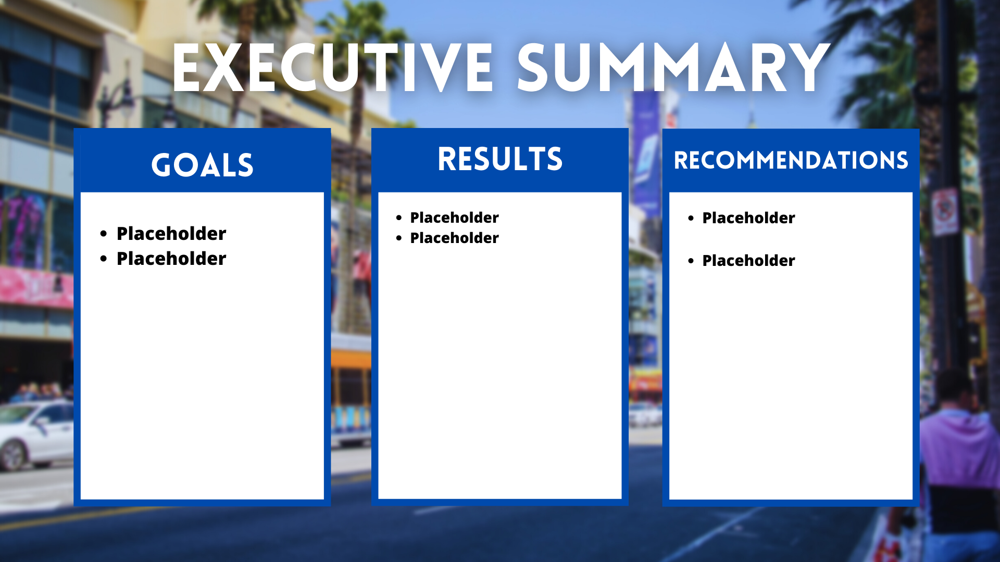

## Business Goal

1. Determine if LADOT's digital communication plan informed the public about street sweeping citations during COVID-19.
2. Determine whether the communitcation plan prevented fines or generated fines.

## Background

### COVID-19 hits California, Street Sweeping Suspended
On March 16, 2020, the Mayor of Los Angeles relaxed parking enforcement across the city, putting a __temporary halt to the issuance of street sweeping citations__.  Suspending citations allowed residents to practice social distancing during the outbreak of COVID-19. - [Source](https://github.com/Promeos/LADOT-COVID19-enforcement/blob/main/city-documents/city-council/LADOT-transition-plan.pdf)
- Once a week, Angelenos are required to move vehicles parked in the street to make way for routine sweeps.
- Failing to do so results in a $73 citation.

### City Council Votes to Resume Street Sweeping
Between September 30, 2020 and October 14, 2020 LADOT and City Council conducted public outreach to inform Angelenos on the timing of __resumed street sweeping enforcement__." - [Source](https://github.com/Promeos/LADOT-COVID19-enforcement/blob/main/city-documents/LADOT/enforcement.pdf)
- LADOT and City Council members used Twitter to spread the initial announcement.
- News stations did not cover the story until October 15, 2020 or later.
- LADOT placed flyers on windshields. [add link to video of news anchors interview with LADOT Representative]

## Data Dictionary

`parking-citations.csv`
| Feature Name           | Feature Description                                                                |
|------------------------|------------------------------------------------------------------------------------|
| issue_date             | Citation date formatted as yyyy-mm-dd                                              |
| issue_time             | Citation time formatted as HH-MM-ss 24HR Military Time                             |
| rp_state_plate         | State license plate of the vehicle i.e. CA, TX                                     |
| plate_expiry_date      | License plate expiration date. yyyy-mm-dd date format.                             |
| make                   | Car manufacturer ex. NISS is Nissan.                                               |
| body_style             | Body style of the car. PA is a Passenger vehicle with four doors.                  |
| color                  | Color of the vehicle.                                                              |
| location               | The street name and number where the citation was issued.                          |
| route                  | Route that issued the citation.                                                    |
| agency                 | Issuing agency. See city-documents/LADOT/agency-names.pdf                          |
| violtion_code          | Alphanumeric code used to indicate the type of violation.                          |
| violation_description  | Short description of the parking citation.                                         |
| fine_amount            | Citation fee in $USD.                                                              |
| latitude               | Latitude of the citation location.                                                 |
| longitude              | Longitude of the citaiton location.                                                |
| day_of_week            | The day of the week the citation was issued.                                       |
| issue_year             | Year of the citation issue date.                                                   |
| issue_hour             | Hour of the citation issue time. 24HR Military Time                                |
| issue_minute           | Minute of the citation issue time.                                                 |

## **City Documents**

Access the Los Angeles City Council documents from the Los Angeles City Clerk's Office [here](https://cityclerk.lacity.org/lacityclerkconnect/index.cfm?fa=ccfi.viewrecord&cfnumber=20-1365).

# Project Steps
## Acquire
__Parking Citation Data__
Download the dataset [here](https://www.kaggle.com/cityofLA/los-angeles-parking-citations/discussion) stored as `parking-citations.csv`. The dataset contains approximately 7 years worth of parking citations issued in Los Angeles, California.

__Text data__
- Twitter: Los Angeles City Council and the Los Angeles Department of Transportation tweets. Requires a API Key and you'll need to apply for a developer account.

## Prepare
**Missing Values**
- Dropped rows missing `latitude` and `longitude` data. 99999.0 indicated a null value.
- Dropped rows missing license plate expiration date.
- Dropped columns: `vin`, `marked_time`, `color_description`, `body_style_description`, `agency_description`, `meter_id`, `ticker_number`.
- Dropped rows with missing values.

**Data Type Casting, Metric Conversion, and Formatting**
- Converted all numeric date columns to datetime.
- Converted `issue_time` from a float to TimeStamp.
- Converted `agency` from a float to an integer.
- Converted `latitude` and `longitude` values from US Feet coordinates \[NAD1983StatePlaneCaliforniaVFIPS0405_Feet projection] to standard coordinates.
  - Used folium and pyproj library to convert the coordinates.
- Removed capitalization and spacing from column names.
  
**Feature Engineering**
- Created a new column called `day_of_week`.
- Created a new column called `issue_year`.
- Created a new column called `issue_hour`.
- Created a new column called `issue_minute`.

## Explore

### City Council and the Los Angeles Department of Transportation Twitter Data

The Los Angeles Department of Transportation generated the most engagement related to parking enforcement.
- @LADOTofficial has 14.2K twitter followers in city with [3,145,520 adults](https://www.google.com/search?client=firefox-b-1-d&q=how+many+adults+live+in+los+angeles), meaning less than 1% of adults follow LADOT.
- Los Angeles City Council Members @, @, @, tweeted once or not at all.
- Mayor Garcetti, @MayorOfLA, has 417.9K followers. That's more than all other city official twitter accounts combined. In the future, he or any mayor, could share city service updates with the public using the mayoral twitter account.

### Street Sweeping Citations
Parking Citations
- Map of citations

### Hypotheses

Were street sweeping fines collected from 10/15/2020 - 11/15/2020 significantly greater than average?
> 𝐻0: Fines collected from 10/15/2020 - 11/15/2020 are less than or equal to the average.
> 
> 𝐻1: Fines collected from 10/15/2020 - 11/15/2020 are significantly greater than average.
>
> Outcome: 
 

## Conclusions

## How to Reproduce
### Tools & Requirements
- pyproj
> `pip install pyproj`
- folium
> `pip install folium`

All files are reproducible and available for download and use.
- [x] Read this README.md
- [ ] Clone this repository
- [ ] Acquire the dataset from [Kaggle](https://www.kaggle.com/cityofLA/los-angeles-parking-citations?select=LADOT-Xerox+Crib+Sheet+Agency+Codes+12-31-2015+%281%29.pdf).
- [ ] Run Final-Report.ipynb
